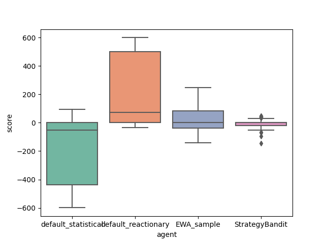
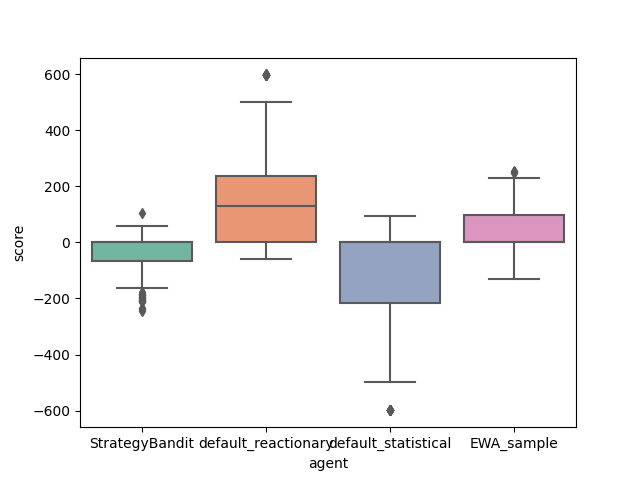
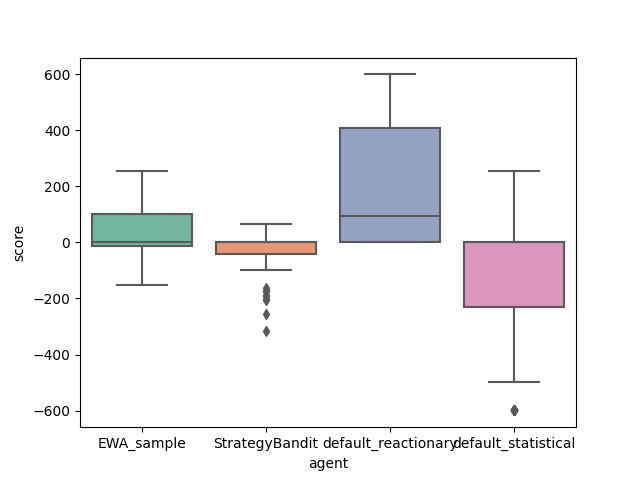

Following from [work presented at a recent Pycon](https://rhettinger.github.io/rock_paper.html#our-approach), we implemented a Bandits agent which learns to choose between different strategies including:

* random
* proportional (sample from possible moves given their preferred moves)
* greedy proportional (same but with argmax instead of sampling)
* two-proportional (same but on two-sequences of plays)
* greedy two-proportional (same but with argmax)
* counter reactionary (same as gym's `counter_reactionary`)

The performance against our EWA and base agents is shown below. Note that the performance is centered close to zero, very tightly and tends to underperform against baseline approaches. This may be linked to the fact that we have complete information but are in a POMDP environment instead of MDP (the classic bandits setting).

We tried to implement epsilon-greedy exploration but this did not help the performance (nor for $\varepsilon=0.05$ nor for $\varepsilon=0.1$).

|| |
|-------|-------|
| { width=50% }  | with $\varepsilon = 0$|
| { width=50% }  | with $\varepsilon = 0.05$|
| { width=50% }  | with $\varepsilon = 0.1$|
